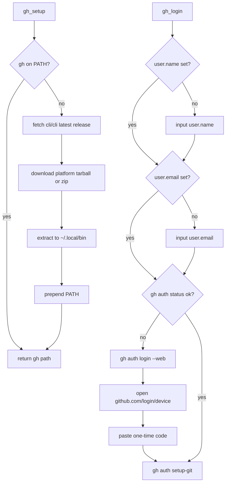

# githublex

Cross-platform bootstrap for GitHub CLI on Google Colab, no-sudo Ubuntu/Jupyter, and Windows. The library installs `gh` into `$HOME/.local/bin` without elevated privileges, configures git identity, and completes OAuth device login in the browser.

## Overview

Many notebooks and remote shells ship without GitHub CLI or without permission to run `apt install`. Push workflows then fail before the first commit. githublex resolves the gap with two calls:

```python
from githublex import gh_setup, gh_login

gh_setup()
gh_login()
```

`gh_setup()` downloads the latest official `gh` release from [cli/cli](https://github.com/cli/cli), extracts the binary into `~/.local/bin`, and prepends that directory to `PATH` for the current process. `gh_login()` prompts for `user.name` and `user.email` when they are unset, runs `gh auth login --web` with `BROWSER=false`, and wires git credentials through `gh auth setup-git`.

The OAuth device flow follows RFC 8628. GitHub CLI requests a device code, prints a one-time token, and polls until the user authorises the session at `https://github.com/login/device`.

## Project tree

```
githublex/
├── githublex/
│   ├── __init__.py      # public API: gh_setup, gh_login
│   ├── auth.py          # git identity + gh auth login
│   ├── installer.py     # download and extract gh
│   ├── platform.py      # OS/arch detection, PATH
│   └── release.py         # GitHub releases API
├── main.py              # CLI entry point
├── pyproject.toml
├── README.md
└── LICENSE
```

## Installation

From GitHub:

```bash
pip install git+https://github.com/pymlex/githublex.git
```

Editable checkout:

```bash
git clone https://github.com/pymlex/githublex.git
cd githublex
pip install -e .
```

## Usage

### Library

```python
from githublex import gh_setup, gh_login

gh_path = gh_setup()
gh_login()
```

Optional git identity without prompts:

```python
gh_login(name="Alex Zyukov", email="you@example.com")
```

### CLI

```bash
githublex
```

Equivalent to running `gh_setup()` followed by `gh_login()`.

### Colab cell

```python
!pip install -q git+https://github.com/pymlex/githublex.git
from githublex import gh_setup, gh_login

gh_setup()
gh_login()
```

After authorisation, `git push` and `gh repo create` use the stored token.

## Flow



## Platform matrix

| Environment | Install target | Auth |
| --- | --- | --- |
| Ubuntu without sudo | `~/.local/bin/gh` | browser device code |
| Google Colab | `~/.local/bin/gh` | browser device code |
| Windows 10 | `%USERPROFILE%\.local\bin\gh.exe` | browser device code |
| Jupyter with existing gh | skipped | browser device code if needed |

Supported CPU targets: `amd64`, `arm64`, `386`, `armv6`.

## Requirements

- Python $\ge 3.9$
- `git` available on `PATH`
- Network access to `github.com` and `api.github.com`

## Citation

If you found this project useful, please cite it as:

```bibtex
@software{zyukov2026githublex,
  author = {Alex Zyukov},
  title = {githublex: GitHub CLI bootstrap for Colab and restricted Linux},
  year = {2026},
  url = {https://github.com/pymlex/githublex},
  publisher = {GitHub},
  organization = {pymlex}
}
```

```bibtex
@misc{githubcli,
  author = {{GitHub}},
  title = {GitHub CLI},
  year = {2026},
  url = {https://github.com/cli/cli}
}
```

The project is under GPL-3.0 license.
